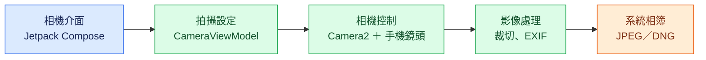
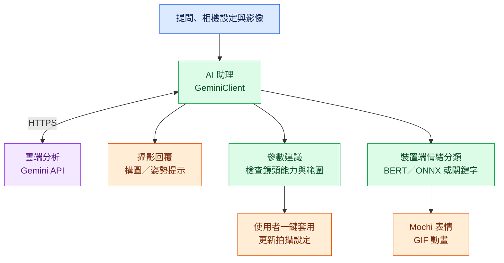

# AI_camera

## 問題與目標

照片是記錄生活的方式之一，讓我們留住稍縱即逝、值得紀念的瞬間。隨著社群媒體普及，越來越多人透過照片分享日常、傳遞情感，也希望影像能呈現當下眼中所見的美好。然而，即使手機相機的功能日益強大，設備的進步仍無法完全補足攝影技巧與經驗的落差。同樣的場景，可能因為取景角度、構圖、人物姿勢或拍攝設定的不同，讓成品與期待產生距離；對缺乏攝影經驗的人而言，往往知道照片不夠理想，卻不知道該從哪裡調整。

我們相信，每個值得拍下的瞬間，都值得尋找一個成本更低、更容易實踐的改善方法。有時只需要移動一步、稍微傾斜鏡頭、調整姿勢，或改變一項拍攝參數，就能讓照片更接近心中的樣子。我們希望降低改善照片所需的學習時間、操作負擔與反覆嘗試，讓使用者透過手邊的手機，就能在拍攝當下獲得具體、可執行的協助。

因此，我們開發了 AI_camera，將手動相機與 AI 攝影助理 Mochi 結合，為喜歡記錄生活、分享照片，以及想提升拍攝能力的使用者，提供攝影問答、可一鍵套用的參數建議、即時構圖引導與拍照後的姿勢回饋。我們的目標是讓攝影建議融入實際拍攝過程，幫助使用者理解如何調整、逐步累積經驗，並以更少的摸索，留下更貼近自己期待的生活片刻。

## 核心功能

### 1. 隨拍隨問的 AI 攝影助理

點按取景畫面上的助理按鈕，即可與 Mochi 討論拍攝問題。助理會參考當下的 ISO、快門、白平衡、對焦、變焦與閃光燈設定，以及目前鏡頭的能力，讓建議與使用者正在操作的相機連結。

例如，可以詢問「為什麼用現在的設定拍起來會模糊？」或「想拍清楚跑動中的狗，快門該怎麼調？」透過對話理解參數與拍攝結果之間的關係，再回到取景畫面實際嘗試。

### 2. 用自然語言描述風格，一鍵套用設定

使用者可以直接說出想要的感覺，例如「我想要暖色調」或「想拍出比較有電影感的畫面」。Mochi 會依需求提供拍攝建議，並在適用時附上列出具體參數的建議卡片。

按下卡片上的套用按鈕，即可將建議更新至相機，省去逐項尋找與調整控制項的操作。系統會依目前鏡頭的能力處理參數，使用者也能在套用後繼續手動微調。這項功能透過拍攝設定塑造畫面風格。

### 3. 即時構圖引導

長按助理按鈕並選擇即時構圖模式後，系統會定期分析取景畫面，根據主體位置與畫面水平等資訊，提供移動、傾斜或調整距離的提示，讓使用者一邊看著畫面、一邊修正拍攝角度。

畫面每次呈現一個主要調整方向，例如向右移動、向下傾斜，或提示目前構圖良好。系統也會參考最近幾次分析結果，減少提示反覆變動，讓調整過程更連貫。

### 4. 拍照後的姿勢回饋

在助理模式選單中選擇姿勢模式，拍照後便會開啟助理，針對剛拍下的照片提供姿勢分析與調整建議。使用者可以先拍一張、閱讀回饋，再調整姿勢重新拍攝，將建議直接用於下一次嘗試。

即時構圖與姿勢回饋可依拍攝需求切換：前者協助拍攝前的取景，後者協助檢視拍攝後的成果。

### 5. 完整手動相機控制

相機提供以下控制項，讓使用者依現場光線、拍攝主體與想呈現的效果調整畫面；介面會依鏡頭能力顯示可用選項。

| 控制項 | 操作與用途 |
| --- | --- |
| ISO 與快門 | 調整感光度與曝光時間，掌握畫面亮度及動態呈現 |
| 曝光補償 | 在自動曝光模式下快速調亮或調暗畫面 |
| 白平衡 | 選擇白平衡預設，或以 2000–10000K 手動色溫調整冷暖感 |
| 對焦 | 支援自動對焦、點按畫面對焦，以及從近距離到無限遠的手動調整 |
| 數位變焦 | 調整取景範圍與主體在畫面中的大小 |
| 閃光燈 | 提供關閉、自動、開啟與持續補光模式 |
| 照片比例 | 選擇完整比例、4:3、16:9 或 1:1，配合不同構圖需求 |
| JPEG 品質 | 在 50–100 之間調整儲存品質 |

### 6. 依構圖需求選擇照片比例

使用者可在相機控制面板選擇照片比例，安排主體與背景在畫面中的位置。預設為 4:3，目前提供以下四種選項：

| 比例選項 | 橫向照片 | 直向照片 | 構圖用途 |
| --- | --- | --- | --- |
| Full（完整比例） | 依相機原始輸出 | 依相機原始輸出 | 保留原始拍攝範圍，方便後續裁切 |
| 4:3 | 4:3 | 3:4 | 適合日常記錄與人物拍攝，兼顧主體和周圍環境 |
| 16:9 | 16:9 | 9:16 | 橫向可呈現較寬的場景，直向可強調人物或垂直線條 |
| 1:1 | 1:1 | 1:1 | 正方形構圖，適合集中呈現主體 |

比例以照片觀看方向的「寬：高」表示，因此選擇 4:3 直拍時，照片呈現為 3:4；選擇 16:9 直拍時，則呈現為 9:16。介面的比例選項名稱維持 4:3 與 16:9。

JPEG 會依所選比例進行中央裁切，Full 則保留原始輸出比例；同時儲存的 RAW（DNG）保留原始資料。目前比例選項為上述四種，2:1 與自訂比例尚未加入。

### 7. 拍攝輔助與照片儲存

取景畫面整合九宮格、水平儀與即時亮度直方圖，分別協助安排主體位置、校正畫面傾斜，以及觀察明暗分布。搭配自拍計時與前後鏡頭切換，可用於日常記錄、自拍與人物拍攝。前鏡頭採鏡像預覽，方便取景，儲存照片則保留非鏡像影像。

照片會儲存至系統相簿，並寫入 EXIF 拍攝資訊，方便回顧當時使用的設定。支援 RAW 的鏡頭可同時輸出 DNG 與 JPEG，兼顧直接使用與後續編修需求。

### 8. 有表情的 Mochi 與多語介面

Mochi 會隨著回覆內容切換開心、害怕、生氣、失落、好奇、戲謔與中性七種 GIF 表情，讓攝影問答更有互動感。系統將回覆分段後進行情緒分類，讓角色表情隨對話內容變化。

App 介面支援繁體中文、英文與日文，可在設定中切換或跟隨系統語言；AI 助理則依使用者提問的語言回覆。

## 系統架構

架構分為「拍攝與儲存」及「AI 攝影助理」兩條流程。藍色為操作介面、綠色為裝置端處理、紫色為雲端服務、橘色為輸出結果。

### 拍攝與儲存



### AI 攝影助理



前端與相機控制邏輯皆在 Android App 內執行，透過 Camera2 操作硬體。AI 功能由 App 直接呼叫 Gemini API，目前沒有獨立後端或應用程式資料庫；照片透過 Android MediaStore 儲存。情緒分類在裝置端執行，GIF 素材由 App assets 載入。

主要程式目錄位於 `app/src/main/java/com/example/ai_camera/`：

| 目錄 | 職責 |
| --- | --- |
| `camera/` | 相機工作階段、拍攝參數、鏡頭能力、影像處理與儲存 |
| `ai/` | Gemini 通訊、對話介面、風格建議與構圖判斷 |
| `emotion/` | 文字分段、WordPiece 分詞、情緒分類與角色動畫 |
| `settings/` | App 語言與設定介面 |
| `ui/` | 取景畫面、控制面板、狀態管理與輔助疊圖 |

## 使用技術

| 類型 | 技術／服務 | 用途 |
| --- | --- | --- |
| AI 模型 | Gemini（預設 `gemini-2.5-flash`） | 攝影問答、參數建議、構圖與姿勢分析 |
| AI 模型 | 中文 BERT、int8 ONNX、ONNX Runtime | 裝置端文字情緒分類；模型需另行提供 |
| 前端 | Kotlin、Jetpack Compose、Material 3 | Android 相機與助理操作介面 |
| 後端 | 無獨立後端；App 內的 GeminiClient | 直接呼叫 Gemini API |
| 相機與儲存 | Camera2、MediaStore、ExifInterface | 手動拍攝、照片儲存與 EXIF 寫入 |
| 非同步與圖片 | Kotlin Coroutines、Coil | 非同步處理與 GIF 顯示 |
| 建置工具 | Gradle Wrapper、Android SDK | 建置、測試與安裝 Android App |

## 安裝與執行

### 1. 準備開發環境

AI_camera 是 Android 原生 App，可透過 Android Studio 開啟專案、建置並安裝到手機。開發環境與裝置需求如下：

| 項目 | 版本／設定 | 用途 |
| --- | --- | --- |
| Android Studio | 可開啟本專案並執行 Gradle 同步的版本 | 編輯專案、管理 SDK 與執行 App |
| JDK | 21 | 執行 Gradle 建置 |
| Android SDK | Platform 35 | 編譯 App |
| Android 裝置 | Android 7.0（API 24）以上 | 執行與測試相機功能 |
| 處理器架構 | `arm64-v8a` 或 `x86_64` | 目前 APK 包含的原生程式庫架構 |

在 Android Studio 的 **Settings → Build, Execution, Deployment → Build Tools → Gradle** 中，將 Gradle JDK 設為 JDK 21，並透過 SDK Manager 安裝 Android SDK Platform 35。若使用命令列建置，將 `JAVA_HOME` 指向 JDK 21，並在 `local.properties` 設定本機 Android SDK 的 `sdk.dir` 路徑。

### 2. 取得並開啟專案

先下載儲存庫，或使用 Git 取得原始碼：

```bash
git clone https://github.com/Winnie-0917/AI_camera.git
cd AI_camera
```

在 Android Studio 選擇 **Open**，開啟包含 `settings.gradle.kts` 的專案根目錄，等待 Gradle 同步完成。以下命令皆在此目錄執行。

### 3. 連接 Gemini 攝影助理

Mochi 的攝影問答、風格建議與影像分析使用 Gemini API。從 [Google AI Studio](https://aistudio.google.com/apikey) 取得 API key 後，將專案內的 `.env.example` 複製為 `.env`。

Windows PowerShell：

```powershell
Copy-Item .env.example .env
```

macOS／Linux／Git Bash：

```bash
cp .env.example .env
```

開啟 `.env`，填入金鑰與模型設定：

```properties
GEMINI_API_KEY=your_key_here
GEMINI_MODEL=gemini-2.5-flash
```

`GEMINI_MODEL` 的預設值為 `gemini-2.5-flash`，也可填入帳號可使用的模型名稱。設定會在建置時讀取，更新後重新執行下一節的乾淨建置即可。若先體驗相機功能，可略過此步驟。

### 4. 建置並安裝到裝置

將手機連接電腦，在手機的開發人員選項中啟用 USB 偵錯，並允許本次連線。接著在 Android Studio 選擇該裝置，按下 **Run** 即可建置與安裝；也可使用以下命令完成相同流程。

Windows PowerShell：

```powershell
.\gradlew.bat clean assembleDebug
.\gradlew.bat installDebug
```

macOS／Linux／Git Bash：

```bash
./gradlew clean assembleDebug
./gradlew installDebug
```

建置完成後，APK 位於 `app/build/outputs/apk/debug/app-debug.apk`。首次開啟 App 時，依系統提示授予相機及必要的儲存權限，即可進入取景畫面。

### 5. 開始第一次拍攝

進入相機後，可先選擇鏡頭與照片比例，再依需求開啟九宮格、水平儀或調整拍攝參數。按下快門後，照片會儲存至系統相簿。

| 想體驗的功能 | 操作方式 |
| --- | --- |
| 手動拍攝 | 在控制面板調整 ISO、快門、白平衡或對焦，再按下快門 |
| 切換照片比例 | 在比例選項中選擇 Full、4:3、16:9 或 1:1 |
| 攝影問答 | 點按助理按鈕，輸入拍攝問題 |
| 一鍵套用風格 | 描述想要的風格，再按建議卡片上的套用按鈕 |
| 即時構圖 | 長按助理按鈕，從模式選單選擇即時構圖 |
| 姿勢回饋 | 長按助理按鈕選擇姿勢模式，拍照後查看分析 |
| 切換介面語言 | 在設定中選擇繁體中文、英文、日文或跟隨系統 |

### 6. 加入裝置端情緒模型（選用）

App 已包含 Mochi 的 GIF 表情與詞彙表，預設可透過關鍵字分類呈現情緒。若要使用 BERT 情緒分類，將相容的 `emotion_int8.onnx` 放入以下位置，搭配對應的 `vocab.txt` 後重新建置：

```text
app/src/main/assets/emotion/
├── emotion_int8.onnx
└── vocab.txt
```

模型權重與匯出工具目前未隨儲存庫提供；取得相容模型後即可依上述方式整合。

## 作品展示

- 作品展示網址（選填）：無。
- 評選影片：待補充。
- 建議展示流程：手動調整拍攝參數 → 向 Mochi 詢問攝影建議 → 一鍵套用風格 → 啟用即時構圖 → 切換姿勢模式並拍照。

## 限制與未來工作

目前可用的手動控制與 RAW 拍攝取決於手機鏡頭能力；手動色溫在不同光源下仍有校準差異。AI 問答與影像分析透過 Gemini 雲端服務執行，需要網路連線，回應速度與可用次數受服務狀態及配額影響。

後續將著重於不同手機的相機相容性、白平衡校準、構圖與姿勢建議品質，以及 AI 分析頻率與等待時間的改善，並補齊情緒模型的取得與匯出流程，讓專案更容易重現。

## 第三方服務、資料與素材

主要服務、技術與素材來源如下，授權資訊依各元件隨附文件整理。

| 項目 | 來源／連結 | 使用方式與授權狀態 |
| --- | --- | --- |
| Gemini API | [Google AI Studio](https://aistudio.google.com/apikey) | 雲端 AI 服務；依服務條款與帳號配額使用 |
| Android、AndroidX、Jetpack Compose | [Android 開發文件](https://developer.android.com/) | 相機、介面與儲存相關元件；依各元件隨附授權 |
| Kotlin、Kotlin Coroutines | [Kotlin](https://kotlinlang.org/) | 程式語言與非同步處理；依各元件隨附授權 |
| ONNX Runtime | [原始碼儲存庫](https://github.com/microsoft/onnxruntime) | 裝置端推論；依所用版本隨附授權 |
| Coil | [原始碼儲存庫](https://github.com/coil-kt/coil) | 圖片與 GIF 載入；依所用版本隨附授權 |
| 中文 BERT 情緒模型與詞彙表 | 由 AI 生成；存放於 `app/src/main/assets/emotion/`（目前僅含詞彙表） | 用於裝置端情緒分類；生成工具與授權資訊待補充 |
| Mochi GIF、角色圖與 App 圖示 | 由 AI 生成；存放於 `app/src/main/assets/icon_gif/`、`app/src/main/res/` | 用於角色表情、助理形象與 App 識別；生成工具與授權資訊待補充 |

## 團隊成員

| 姓名 | 分工 |
| 郭孟勳 | 待補充
| 沈晨利 | 待補充
| 許又升 | 待補充
| 朱永成 | 待補充
| 潘科伸 | 待補充

## License

無
