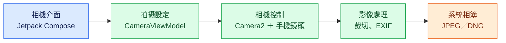
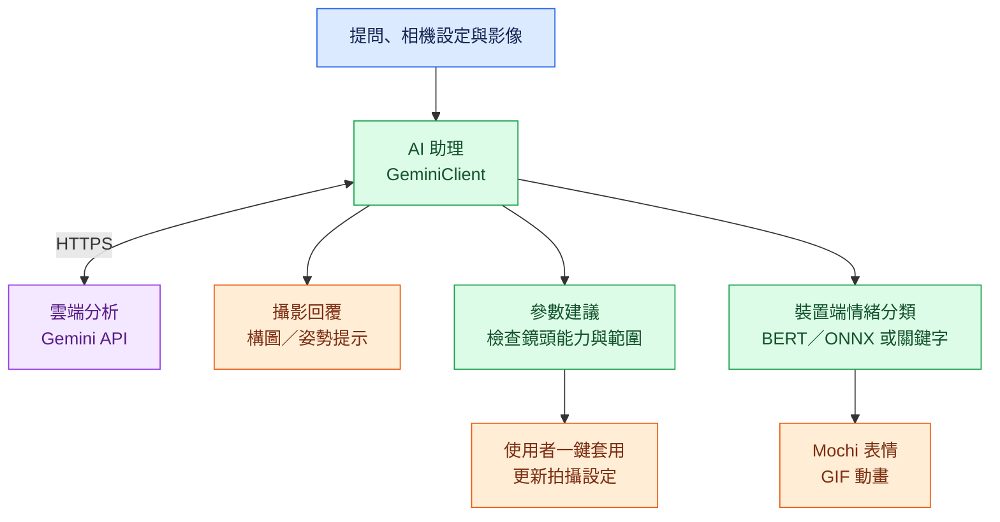

# AI_camera

## 問題與目標

手機攝影初學者往往難以理解 ISO、快門、白平衡與構圖之間的關係，也不容易將攝影建議轉換成實際設定。AI_camera 是一款 Android 手動相機，面向想學習攝影或需要細部控制拍攝參數的使用者，結合 Camera2 與 Gemini 攝影助理 Mochi，協助使用者在拍攝過程中理解設定、調整風格並改善構圖。

## 核心功能

- **手動攝影控制**：支援 ISO、快門、曝光補償、白平衡預設與手動色溫（2000–10000K）、自動／點按／手動對焦、數位變焦、JPEG 品質、閃光燈及照片比例。依鏡頭能力自動隱藏不支援的選項。
- **拍攝輔助與儲存**：支援 RAW（DNG）與 JPEG 同時拍攝、即時亮度直方圖、九宮格、水平儀、自拍計時、EXIF 資訊及前後鏡頭切換。前鏡頭預覽採鏡像顯示，儲存照片維持非鏡像影像。
- **AI 攝影問答與一鍵套用**：將目前相機設定與鏡頭能力提供給 Gemini，回答拍攝問題。風格建議以結構化參數卡片呈現，套用前會檢查硬體能力並限制參數範圍。
- **構圖與姿勢建議**：即時構圖模式定期分析取景畫面，提供移動或傾斜相機的提示；姿勢模式在拍照後開啟助理，分析照片中的姿勢。
- **情緒角色與多語介面**：Mochi 依回覆文字切換七種情緒 GIF；支援英文、繁體中文與日文介面。情緒分類支援裝置端 BERT／ONNX 推論，模型不可用時改用關鍵字分類。

## 系統架構

架構分為「拍攝與儲存」及「AI 攝影助理」兩條流程。藍色為操作介面、綠色為裝置端處理、紫色為雲端服務、橘色為輸出結果。

### 拍攝與儲存



### AI 攝影助理



前端與相機控制邏輯皆在 Android App 內執行，透過 Camera2 操作硬體。AI 功能由 App 直接呼叫 Gemini API，目前沒有獨立後端或應用程式資料庫；照片透過 Android MediaStore 儲存。情緒分類在裝置端執行，GIF 素材由 App assets 載入。

主要程式目錄位於 `app/src/main/java/com/example/ai_camera/`：

| 目錄 | 職責 |
| --- | --- |
| `camera/` | 相機工作階段、拍攝參數、鏡頭能力、影像處理與儲存 |
| `ai/` | Gemini 通訊、對話介面、風格建議與構圖判斷 |
| `emotion/` | 文字分段、WordPiece 分詞、情緒分類與角色動畫 |
| `settings/` | App 語言與設定介面 |
| `ui/` | 取景畫面、控制面板、狀態管理與輔助疊圖 |

## 使用技術

| 類型 | 技術／服務 | 用途 |
| --- | --- | --- |
| AI 模型 | Gemini（預設 `gemini-2.5-flash`） | 攝影問答、參數建議、構圖與姿勢分析 |
| AI 模型 | 中文 BERT、int8 ONNX、ONNX Runtime | 裝置端文字情緒分類；模型需另行提供 |
| 前端 | Kotlin、Jetpack Compose、Material 3 | Android 相機與助理操作介面 |
| 後端 | 無獨立後端；App 內的 GeminiClient | 直接呼叫 Gemini API |
| 相機與儲存 | Camera2、MediaStore、ExifInterface | 手動拍攝、照片儲存與 EXIF 寫入 |
| 非同步與圖片 | Kotlin Coroutines、Coil | 非同步處理與 GIF 顯示 |
| 建置工具 | Gradle Wrapper、Android SDK | 建置、測試與安裝 Android App |

## 安裝與執行

### 1. 環境需求

- Android Studio 與 JDK 21；在 Android Studio 的 Gradle JDK 設定中選擇 JDK 21。
- Android SDK Platform 35，並完成 Android SDK 路徑設定（可由 Android Studio 開啟專案後設定，或於 `local.properties` 設定 `sdk.dir`）。
- Android 7.0（API 24）以上的裝置；目前建置包含 `arm64-v8a` 與 `x86_64` ABI。
- 實機測試需啟用 USB 偵錯並允許電腦連線。完整手動控制與 RAW 功能須由實機鏡頭支援。

### 2. 設定 Gemini API

在專案根目錄（與 `settings.gradle.kts` 同層）複製設定範本：

```bash
# macOS／Linux／Git Bash
cp .env.example .env
```

Windows PowerShell：

```powershell
Copy-Item .env.example .env
```

從 [Google AI Studio](https://aistudio.google.com/apikey) 取得 API key，編輯 `.env`：

```properties
GEMINI_API_KEY=your_key_here
GEMINI_MODEL=gemini-2.5-flash
```

`GEMINI_MODEL` 可省略，預設值為 `gemini-2.5-flash`，實際可用模型依帳號權限而定。建置時會優先讀取 `.env` 中的設定，缺少的欄位再讀取同名環境變數。若不使用 AI 功能，可不建立 `.env`，相機仍可建置與執行。

### 3. 建置並安裝

在專案根目錄執行，並確認 Gradle 使用 JDK 21、裝置已連線：

```bash
# macOS／Linux／Git Bash
./gradlew clean assembleDebug
./gradlew installDebug
```

Windows PowerShell：

```powershell
.\gradlew.bat clean assembleDebug
.\gradlew.bat installDebug
```

Debug APK 產出位置：`app/build/outputs/apk/debug/app-debug.apk`。也可使用 Android Studio 開啟專案，完成 Gradle 同步後選擇裝置並執行。首次開啟 App 時，依系統提示授予相機及必要的儲存權限。

### 4. 操作方式

- 使用取景畫面的控制面板調整拍攝參數，再按快門拍照。
- 點按取景畫面右上方的助理按鈕，詢問「現在這個光線該用什麼設定？」或「我想要暖色調」。若回覆包含建議卡片，可按套用更新相機設定。
- 長按助理按鈕開啟模式選單，選擇即時構圖、拍照後姿勢建議或關閉。構圖與姿勢模式互斥。
- 在設定中切換英文、繁體中文、日文，或跟隨系統語言。

### 5. 選用：情緒模型

目前儲存庫包含詞彙表與 GIF，但不包含 `emotion_int8.onnx`、訓練 checkpoint 或 `emotion_model/` 匯出工具。缺少模型時，App 會自動改用關鍵字情緒分類，仍可執行。

若已有與此專案相容的模型，將其放入 `app/src/main/assets/emotion/emotion_int8.onnx`，確認同目錄的 `vocab.txt` 與模型相符後重新建置。完整 BERT 情緒分類的重現仍需團隊補充模型來源、授權與匯出流程。

## 作品展示

- 作品展示網址（選填）：待補充。
- 評選影片：待補充。
- 建議展示流程：手動調整拍攝參數 → 向 Mochi 詢問攝影建議 → 一鍵套用風格 → 啟用即時構圖 → 切換姿勢模式並拍照。

## 限制與未來工作

- **硬體限制**：手動 ISO／快門需 `MANUAL_SENSOR` 能力，RAW 需 `RAW` 能力；不支援的控制項會隱藏。關閉自動曝光後，ISO 與快門必須共同設定；曝光補償僅適用於自動曝光。
- **白平衡限制**：手動色溫相對於裝置自動白平衡增益調整，非日光環境下的標示色溫可能與實際色溫有落差。
- **網路與配額**：Gemini 功能需網路及有效 API key。即時構圖在需修正時約每 5 秒分析一次、構圖良好時約每 8 秒一次；失敗時採指數退避，最長間隔 2 分鐘。持續使用會增加 API 用量。
- **影像傳輸**：使用構圖或姿勢分析時，相關影像會傳送至 Gemini；公開發佈前需完善資料使用說明與使用者同意流程。
- **模型與素材重現**：BERT 模型權重與匯出工具未納入儲存庫，來源及授權尚待補齊；目前可使用關鍵字分類替代。
- **後續方向**：建立保管金鑰的後端、補齊模型與素材授權、擴充不同裝置的相機相容性驗證，並持續改善構圖與姿勢建議品質。

## 第三方服務、資料與素材

以下列出目前使用的主要服務、技術及素材來源。第三方元件的確切授權與聲明應以所用版本隨附文件為準；尚未確認的項目標示為待補充。

| 項目 | 來源／連結 | 使用方式與授權狀態 |
| --- | --- | --- |
| Gemini API | [Google AI Studio](https://aistudio.google.com/apikey) | 雲端 AI 服務；依服務條款與帳號配額使用 |
| Android、AndroidX、Jetpack Compose | [Android 開發文件](https://developer.android.com/) | 相機、介面與儲存相關元件；依各元件隨附授權 |
| Kotlin、Kotlin Coroutines | [Kotlin](https://kotlinlang.org/) | 程式語言與非同步處理；依各元件隨附授權 |
| ONNX Runtime | [原始碼儲存庫](https://github.com/microsoft/onnxruntime) | 裝置端推論；依所用版本隨附授權 |
| Coil | [原始碼儲存庫](https://github.com/coil-kt/coil) | 圖片與 GIF 載入；依所用版本隨附授權 |
| 中文 BERT 情緒模型與詞彙表 | `app/src/main/assets/emotion/`（目前僅含詞彙表） | 基礎模型、訓練資料、權重下載連結與授權待補充 |
| Mochi GIF、角色圖與 App 圖示 | `app/src/main/assets/icon_gif/`、`app/src/main/res/` | 作者、原始來源與授權方式待補充 |

請勿提交 API key、Token 或個人資料；用於展示的照片與影片也應確認具有使用權限。

## 團隊成員

| 姓名 | 分工 |
| --- | --- |
| 待補充 | 待補充 |

## License

目前儲存庫尚未包含 `LICENSE` 檔案，專案授權尚待團隊確認。選定授權後，請於根目錄加入對應的 `LICENSE`，並在此標示授權名稱；第三方服務、模型與素材仍依各自的條款或授權使用。
